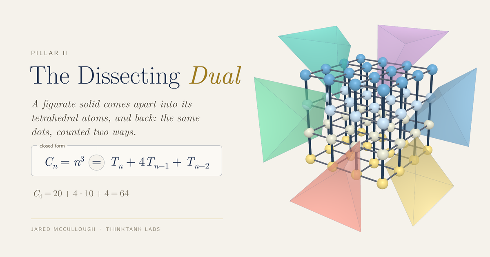

# The Dissecting Dual

A live, interactive 3D viewer of six figurate solids, each counted two ways. Assembled, a solid is a lattice of dots, and its closed form counts every dot at once. Dissected, it comes apart into tetrahedral atoms, and the Kim identity counts the same dots atom by atom. A slider moves between the two, so you can watch one count become the other.

**[Open the live page](https://jaredm-research.github.io/dissecting_dual_demo/)**



## What you can do with it

- Choose one of six solids (tetrahedral, square pyramidal, octahedral, cubic, the stella octangula and the centered cube) and its size, *n*.
- Drag the slider from Assemble to Dissect, and the solid's tetrahedral atoms come out of it while the lattice of dots stays whole. Play runs it once, and Auto-Morph runs it back and forth.
- Point at a term of the Kim identity, or tap it, and the dots it counts light up. Its number in the worked line does the same.
- Switch between three views: the lattice, the atoms laid over it, or the atoms alone.
- Use the key to show the dots, the layers or either kind of bond. Keep the layers, and the figure builds itself one layer at a time, each layer counted.
- Turn the figure, zoom and move it; Auto-rotate and Reset view sit in the window's corner, and the keyboard has shortcuts.

On a first visit, eight short tips point out the controls. Pillar II, at the top left, opens a guide with pictures of what each part of the page does. A two-page reading guide, [`assets/dissecting_dual_reading_guide.pdf`](assets/dissecting_dual_reading_guide.pdf), explains every feature.

## What this is

This is Pillar II, The Dissecting Dual, the sibling of Pillar I, [The Morphing Dual](https://jaredm-research.github.io/morphing_dual_demo/). It is a single HTML file that runs in a modern browser, on a phone, a tablet or a desktop, with no installation or server; it loads three.js r128 and one typeface from the internet.

The mathematics is published work. The atoms illustrate Theorem 4.1 of H. K. Kim and J. Y. Lee, ["Polytope numbers and their properties,"](https://arxiv.org/abs/1206.0511) arXiv:1206.0511 (2012). For the four convex solids they are the tetrahedra of a pointed triangulation, and the solid's number is a sum of tetrahedral numbers, one for each atom. The stella octangula is counted as two tetrahedra less the octahedron they share, and the centered cube as two cubes, one inside the other. The sequences are from the [On-Line Encyclopedia of Integer Sequences](https://oeis.org): [A000292](https://oeis.org/A000292), [A000330](https://oeis.org/A000330), [A005900](https://oeis.org/A005900), [A000578](https://oeis.org/A000578), [A007588](https://oeis.org/A007588) and [A005898](https://oeis.org/A005898). What the page adds is the two counts seen, and handled, as one figure.

## Repository

This repository holds only the public page and its documentation. Development happens in a private repository, with the source, the mathematics and its verification, every release archive and the full history.

## License

Apache License 2.0: `LICENSE` holds the full text. `NOTICE` is informational. It lists the Latin Modern typefaces embedded in the page, under the GUST Font License in `GUST-FONT-LICENSE.txt`, and the software the page loads at runtime.

## Citation

```
McCullough, J. (2026). The Dissecting Dual (Pillar II), version 0.9.16.
https://jaredm-research.github.io/dissecting_dual_demo/
```

`CITATION.cff` gives the same, with the sources.
